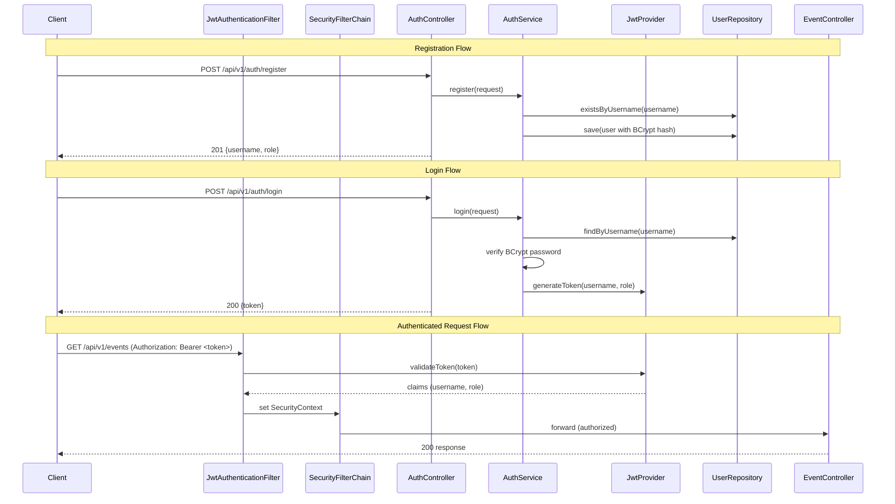
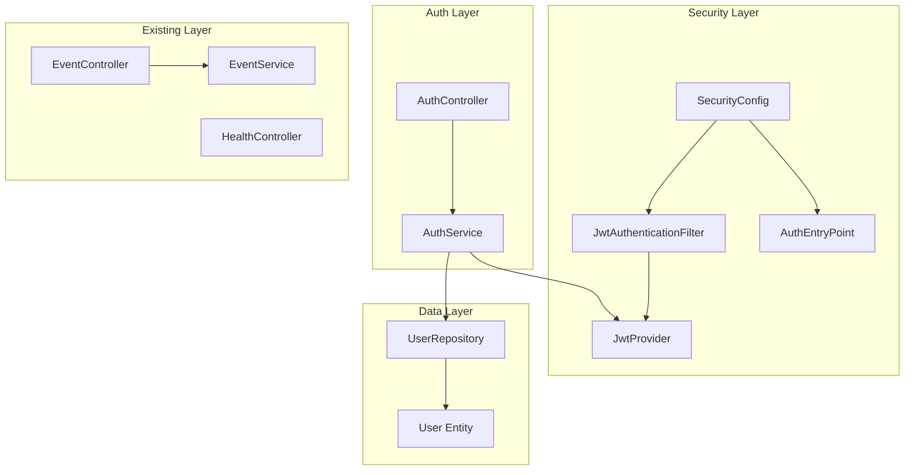
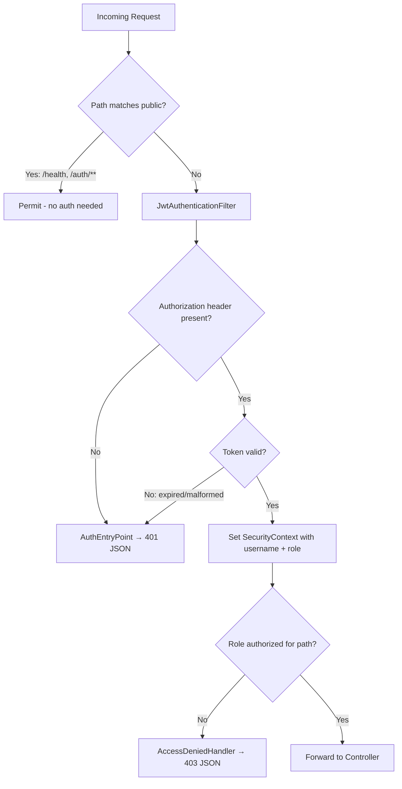

# Design Document: JWT Authentication

## Overview

This design adds JWT-based authentication and role-based authorization to the Secure Event Logging & Search Platform. The implementation follows Zero Trust principles: every request to a protected endpoint must carry a valid JWT token, and access is granted based on the user's role claim within that token.

The system introduces a `users` table, a registration/login flow, a JWT token lifecycle (issue → validate → reject on expiry), and a Spring Security filter chain that enforces access rules before requests reach controllers. The health endpoint and auth endpoints remain publicly accessible.

### Key Design Decisions

1. **Stateless sessions** — No server-side session storage. The JWT is the sole authentication credential per request.
2. **HMAC-SHA256 signing** — Symmetric signing with a shared secret. Suitable for a single-service deployment; asymmetric keys would be needed for multi-service token verification.
3. **Role stored in token** — The role claim is embedded in the JWT at issuance. Role changes require re-authentication.
4. **Filter-based auth** — A `OncePerRequestFilter` extracts and validates the token before Spring Security's authorization checks run.
5. **Existing tests preserved** — Controller tests continue using standalone MockMvc setup; `@WithMockUser` or manual SecurityContext setup provides the authenticated principal.

## Architecture



### Component Interaction Diagram



## Components and Interfaces

### New Files

| File | Package | Responsibility |
|------|---------|----------------|
| `User.java` | `model` | JPA entity for the `users` table |
| `Role.java` | `model` | Enum: `ROLE_ADMIN`, `ROLE_USER` |
| `UserRepository.java` | `repository` | Spring Data JPA repository for User |
| `AuthController.java` | `controller` | REST endpoints: register, login |
| `AuthService.java` | `service` | Registration logic, credential validation, token issuance |
| `JwtProvider.java` | `security` | Token generation, validation, claim extraction |
| `JwtAuthenticationFilter.java` | `security` | OncePerRequestFilter that sets SecurityContext |
| `SecurityConfig.java` | `security` | SecurityFilterChain bean, password encoder bean |
| `AuthEntryPoint.java` | `security` | Custom 401 JSON response for unauthenticated requests |
| `AccessDeniedHandlerImpl.java` | `security` | Custom 403 JSON response for forbidden requests |
| `RegisterRequest.java` | `dto` | DTO for registration input |
| `LoginRequest.java` | `dto` | DTO for login input |
| `AuthResponse.java` | `dto` | DTO for login response (token) |
| `RegisterResponse.java` | `dto` | DTO for registration response (username, role) |

### Modified Files

| File | Change |
|------|--------|
| `pom.xml` | Add `spring-boot-starter-security`, `jjwt-api`, `jjwt-impl`, `jjwt-jackson`, `spring-security-test` dependencies |
| `application.properties` | Add `jwt.secret` and `jwt.expiration-ms` properties |
| `EventControllerTest.java` | Add `@WithMockUser(roles = "ADMIN")` to write tests, `@WithMockUser(roles = "USER")` to read tests |

### Interface Definitions

#### JwtProvider

```java
public class JwtProvider {
    String generateToken(String username, String role);
    boolean validateToken(String token);
    String getUsernameFromToken(String token);
    String getRoleFromToken(String token);
}
```

#### AuthService

```java
public class AuthService {
    RegisterResponse register(RegisterRequest request);
    AuthResponse login(LoginRequest request);
}
```

#### AuthController

```java
@RestController
@RequestMapping("/api/v1/auth")
public class AuthController {
    @PostMapping("/register")  // → 201
    ResponseEntity<RegisterResponse> register(@Valid @RequestBody RegisterRequest request);

    @PostMapping("/login")     // → 200
    ResponseEntity<AuthResponse> login(@Valid @RequestBody LoginRequest request);
}
```

#### JwtAuthenticationFilter

```java
public class JwtAuthenticationFilter extends OncePerRequestFilter {
    @Override
    protected void doFilterInternal(HttpServletRequest request,
                                    HttpServletResponse response,
                                    FilterChain filterChain);
}
```

## Data Models

### User Entity (table: `users`)

| Column | Type | Constraints | Notes |
|--------|------|-------------|-------|
| `id` | UUID | PK, auto-generated | `GenerationType.UUID` |
| `username` | VARCHAR(50) | NOT NULL, UNIQUE | Login identifier |
| `password` | VARCHAR(255) | NOT NULL | BCrypt hash |
| `role` | VARCHAR(20) | NOT NULL | Enum: `ROLE_ADMIN`, `ROLE_USER` |

```java
@Entity
@Table(name = "users")
public class User {
    @Id
    @GeneratedValue(strategy = GenerationType.UUID)
    private UUID id;

    @Column(nullable = false, unique = true, length = 50)
    private String username;

    @Column(nullable = false)
    private String password;

    @Enumerated(EnumType.STRING)
    @Column(nullable = false, length = 20)
    private Role role;
}
```

### Role Enum

```java
public enum Role {
    ROLE_ADMIN,
    ROLE_USER
}
```

### JWT Token Structure

**Header:**
```json
{
  "alg": "HS256",
  "typ": "JWT"
}
```

**Payload:**
```json
{
  "sub": "username",
  "role": "ROLE_ADMIN",
  "iat": 1717000000,
  "exp": 1717086400
}
```

### DTOs

#### RegisterRequest
```java
public class RegisterRequest {
    @NotBlank
    private String username;

    @Size(min = 8)
    private String password;

    @NotNull
    private Role role;
}
```

#### LoginRequest
```java
public class LoginRequest {
    @NotBlank
    private String username;

    @NotBlank
    private String password;
}
```

#### AuthResponse
```java
public class AuthResponse {
    private String token;
    private String type = "Bearer";
}
```

#### RegisterResponse
```java
public class RegisterResponse {
    private String username;
    private String role;
}
```

### Security Filter Chain Flow



### Configuration Properties

```properties
# JWT Configuration
jwt.secret=${JWT_SECRET:default-dev-secret-key-that-is-at-least-32-bytes-long}
jwt.expiration-ms=${JWT_EXPIRATION_MS:86400000}
```

### Dependencies to Add (pom.xml)

```xml
<dependency>
    <groupId>org.springframework.boot</groupId>
    <artifactId>spring-boot-starter-security</artifactId>
</dependency>
<dependency>
    <groupId>io.jsonwebtoken</groupId>
    <artifactId>jjwt-api</artifactId>
    <version>0.12.6</version>
</dependency>
<dependency>
    <groupId>io.jsonwebtoken</groupId>
    <artifactId>jjwt-impl</artifactId>
    <version>0.12.6</version>
    <scope>runtime</scope>
</dependency>
<dependency>
    <groupId>io.jsonwebtoken</groupId>
    <artifactId>jjwt-jackson</artifactId>
    <version>0.12.6</version>
    <scope>runtime</scope>
</dependency>
<dependency>
    <groupId>org.springframework.security</groupId>
    <artifactId>spring-security-test</artifactId>
    <scope>test</scope>
</dependency>
```


## Correctness Properties

*A property is a characteristic or behavior that should hold true across all valid executions of a system—essentially, a formal statement about what the system should do. Properties serve as the bridge between human-readable specifications and machine-verifiable correctness guarantees.*

### Property 1: Token claim round-trip

*For any* valid username and role, generating a JWT token and then extracting the subject and role claim from that token should return the original username and role values.

**Validates: Requirements 2.3**

### Property 2: Password hashing round-trip

*For any* valid password (8+ characters), hashing it with BCrypt and then verifying the original password against the hash should return true, and the hash should not equal the plaintext password.

**Validates: Requirements 1.3, 1.5**

### Property 3: Valid registration produces correct response

*For any* valid registration request (unique username, password ≥8 characters, valid role), the registration response should contain the same username and role that were submitted.

**Validates: Requirements 1.1**

### Property 4: Duplicate registration is rejected

*For any* username, registering it once should succeed, and registering the same username a second time should be rejected with a conflict error.

**Validates: Requirements 1.2**

### Property 5: Invalid registration input is rejected

*For any* registration request where the username is blank or the password is shorter than 8 characters, the system should reject the request with a validation error and not persist any user.

**Validates: Requirements 1.4**

### Property 6: Valid credentials yield a valid token

*For any* registered user, logging in with the correct username and password should return a token that passes validation by the JwtProvider.

**Validates: Requirements 2.1**

### Property 7: Invalid credentials are rejected

*For any* registered user and any password that differs from the registered password, login should be rejected with an unauthorized error.

**Validates: Requirements 2.2**

### Property 8: Filter populates SecurityContext from valid token

*For any* valid JWT token containing a username and role, after the JwtAuthenticationFilter processes a request carrying that token, the SecurityContext should contain an Authentication with the matching username as principal and the matching role as a granted authority.

**Validates: Requirements 3.1, 3.5**

### Property 9: Invalid tokens are rejected

*For any* string that is not a validly signed, non-expired JWT token (including random strings, tokens signed with a different key, and expired tokens), the system should reject the request with a 401 status.

**Validates: Requirements 3.2, 3.4**

### Property 10: Role-based access control enforcement

*For any* authenticated user and any protected endpoint, access is granted if and only if the user's role is in the permitted set for that endpoint (ADMIN for POST /api/v1/events; ADMIN or USER for GET /api/v1/events and GET /api/v1/events/{id}).

**Validates: Requirements 4.1, 4.2, 4.3**

### Property 11: Unknown paths are denied

*For any* request path that is not in the explicitly permitted set (/api/v1/health, /api/v1/auth/**, /api/v1/events/**), an unauthenticated request should receive a 401 response.

**Validates: Requirements 5.3**

### Property 12: Security error responses are structured JSON

*For any* security rejection (401 or 403), the response body should be valid JSON containing `status`, `error`, `message`, and `timestamp` fields consistent with the existing ErrorResponse structure.

**Validates: Requirements 6.1, 6.2**

## Error Handling

### Authentication Errors

| Scenario | HTTP Status | Error Field | Message |
|----------|-------------|-------------|---------|
| No Authorization header on protected endpoint | 401 | Unauthorized | "Authentication required to access this resource" |
| Malformed/invalid JWT token | 401 | Unauthorized | "Invalid or expired authentication token" |
| Expired JWT token | 401 | Unauthorized | "Invalid or expired authentication token" |
| Wrong credentials on login | 401 | Unauthorized | "Invalid username or password" |

### Authorization Errors

| Scenario | HTTP Status | Error Field | Message |
|----------|-------------|-------------|---------|
| USER role accessing POST /api/v1/events | 403 | Forbidden | "Access denied: insufficient permissions" |

### Registration Errors

| Scenario | HTTP Status | Error Field | Message |
|----------|-------------|-------------|---------|
| Duplicate username | 409 | Conflict | "Username 'X' is already taken" |
| Blank username | 400 | Validation Failed | "username: must not be blank" |
| Password < 8 chars | 400 | Validation Failed | "password: size must be between 8 and 2147483647" |

### Error Response Format

All security-related error responses use the existing `ErrorResponse` structure:

```json
{
  "status": 401,
  "error": "Unauthorized",
  "message": "Authentication required to access this resource",
  "timestamp": "2026-05-10T12:00:00Z"
}
```

### Exception Handling Strategy

- `AuthEntryPoint` implements `AuthenticationEntryPoint` — writes 401 JSON response directly to the HttpServletResponse (bypasses controller advice since security filters run before controllers).
- `AccessDeniedHandlerImpl` implements `AccessDeniedHandler` — writes 403 JSON response directly.
- `AuthService` throws:
  - `ResponseStatusException(409)` for duplicate username
  - `ResponseStatusException(401)` for invalid credentials
- Registration validation errors are handled by the existing `GlobalExceptionHandler` via `@Valid` annotations.

## Testing Strategy

### Testing Approach

This feature uses a dual testing approach:

1. **Property-based tests** — Verify universal properties (token round-trips, password hashing, role enforcement) across many generated inputs using jqwik (Java property-based testing library).
2. **Unit tests** — Verify specific examples, edge cases, integration points, and error conditions using JUnit 5 + Mockito + MockMvc.

### Property-Based Testing Configuration

- **Library**: jqwik 1.9.1 (integrates with JUnit 5 platform)
- **Minimum iterations**: 100 per property test
- **Tag format**: `Feature: jwt-authentication, Property {number}: {property_text}`

### Dependencies for Testing

```xml
<dependency>
    <groupId>net.jqwik</groupId>
    <artifactId>jqwik</artifactId>
    <version>1.9.1</version>
    <scope>test</scope>
</dependency>
```

### Test Classes

| Test Class | Type | Tests |  
|------------|------|-------|
| `JwtProviderPropertyTest` | Property | Properties 1, 9 (token round-trip, invalid token rejection) |
| `PasswordHashingPropertyTest` | Property | Property 2 (BCrypt round-trip) |
| `AuthServicePropertyTest` | Property | Properties 3, 4, 5, 6, 7 (registration/login logic) |
| `JwtAuthenticationFilterPropertyTest` | Property | Property 8 (filter → SecurityContext) |
| `SecurityConfigPropertyTest` | Property | Properties 10, 11, 12 (RBAC, unknown paths, error format) |
| `AuthControllerTest` | Unit | Registration and login endpoint examples, edge cases |
| `JwtProviderTest` | Unit | Token expiration config, algorithm verification (criteria 2.4, 2.5) |
| `SecurityConfigTest` | Unit | CSRF disabled, stateless sessions, public endpoints (criteria 4.4, 4.5, 5.1, 5.2) |
| `EventControllerTest` (modified) | Unit | Existing tests with `@WithMockUser` annotations |

### Existing Test Compatibility

The existing `EventControllerTest` uses standalone MockMvc setup (`MockMvcBuilders.standaloneSetup`). This approach does **not** load the Spring Security filter chain, so existing tests will continue to pass without modification to the MockMvc setup itself. However, to document the security contract and ensure tests remain valid if the setup changes in the future, we add `@WithMockUser(roles = "ADMIN")` to POST tests and `@WithMockUser(roles = "USER")` to GET tests. The `EventServiceTest` requires no changes since it tests the service layer directly without HTTP concerns.

### Test Execution

```bash
# Run all tests including property tests
./mvnw test

# Run only property tests
./mvnw test -Dtest="*PropertyTest"
```
